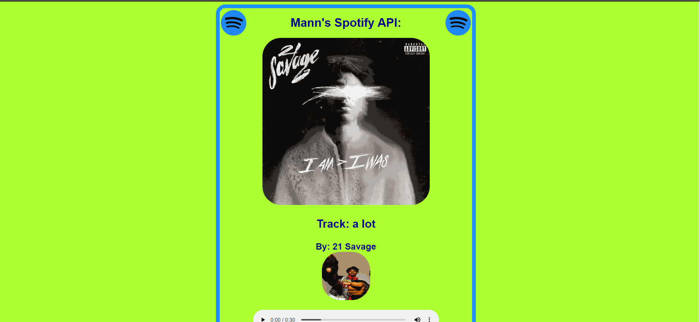

# Project 1 mmp224

### Project Demo
 

### Setting up the project:
- In order to go on about this project, we have to start by getting access to the client credentials to the Spotify API. A spotify account is needed for this. Then go to this link: https://developer.spotify.com/ , open the dashboard and create a Client Id. Once accquired we need to start programming in Python. All files in the main branch help with building this project. But main things to know is the user needs to send GET and POST requests, then we have to pass an access token so we can access the endpoints. Once we successfully GET the request, we need to view it in JSON and parse the information to get the specifics like artists name, song, etc. And after obtaining the info, we can place it in html and showcase the info on it. An addition to this project is the implementation of the Genius API. Just like spotify we need to make a request to Genius by getting an access token from https://genius.com/api-clients. And after that we just implement the info in python as we did for spotify. And from then on its straight forward to parse through the json and get the lyrics url. 
- What's not shown is the .env file, which helps save your API Key from being stolen. In order to do that, create the .env file and inside it add the following 2 lines of code:
1. export CLIENT_ID = 'APIKEY'
2. export CLIENT_SECRET = 'APIKEY'
- And where it says APIKEY, add your own key by following the steps of creating a developer account on https://developer.spotify.com/documentation/web-api/quick-start/
- Make sure once the .env file steps are done, in the .gitignore file add .env which will insure it stays hidden
- Same steps apply for genius

## Project Questions:
### What are at least 3 technical issues you encountered with your project? How did you fix them?
- When trying to fetch the json data for an artists, I initially kept recieving an error with status 401 and it took me some time to realize that I had to get something called and OAuth Token, which ended up fixing the issue.
- And speaking of fetching the json data, in order to print specifics like the song name, artists name, etc. the json that I printed to check was not at all readable to the eyes, and not formatted correctly. I fixed the problem by writing the json data to a random text file so that I could look at it in a proper format. 
- And lastly, although it seems to be a little issue that occured since homework 4 I'd still like to point it out, that just saving the css file doesn't make changes to the final result. In order to fix the issue I kept having to rename the css file or clearing my browsers cache in order for the changes to show up. 

### What are known problems (still existing), if any, with your project?
- Usually the genius lyrics url takes the user to the right page, but I noticed that some songs which have a feature artist or if the artist's name ends up being 'various artists', then the url doesn't show the lyrics, but shows some random page on genius.

### What would you do to improve your project in the future?
- After completing the project, If I were to spend more time on it, there are a few things I'd fix and add. Starting off with a search bar, adding that would give any user the freedom to search for any artist of their liking rather than ones I have picked to showcase. Second, a fix would be to find out the reason behind why some songs aren't redirected to the rigth lyrics when clicking on the url and making sure every song gets the rigth lyrics. Also, if possible, adding a way to showcase the lyrics that are in the preview when the audio player runs would strengthen the web app. 

### Technologies:
- Cloud9

### Framework:
- Flask

### Libraries:
- from flask import Flask, render_template
- import os
- import random
- import requests
- from dotenv import load_dotenv, find_dotenv
- import json 

### APIs:
- Spotify
- Genius
